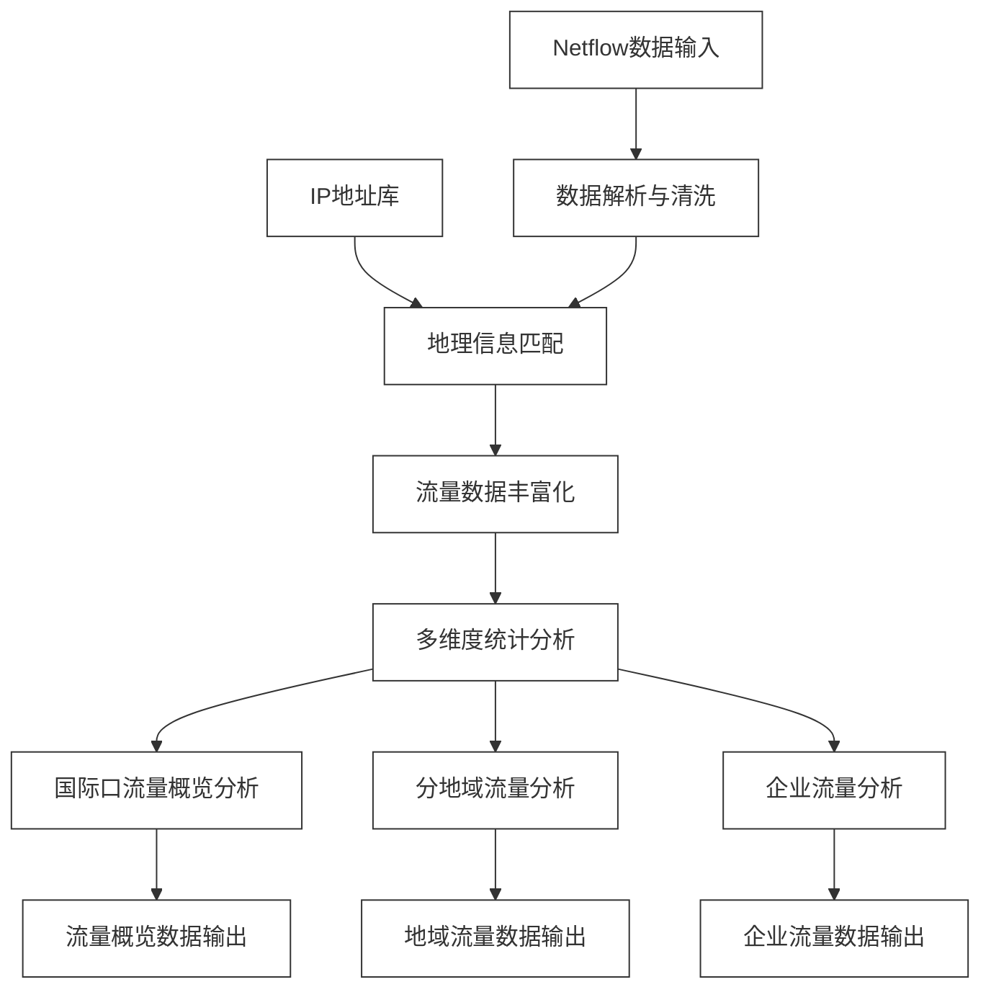

```mermaid
graph TD
    A[Netflow数据输入] --> C[数据解析与清洗]
    B[IP地址库] --> D[地理信息匹配]
    C --> D
    D --> E[流量数据丰富化]
    E --> F[多维度统计分析]

    F --> G1[国际口流量概览分析]
    G1 --> G2[流量概览数据输出]

    F --> H1[分地域流量分析]
    H1 --> H2[地域流量数据输出]

    F --> I1[企业流量分析]
    I1 --> I2[企业流量数据输出]

    style A fill:#fff,stroke:#333,stroke-width:1px
    style B fill:#fff,stroke:#333,stroke-width:1px
    style C fill:#fff,stroke:#333,stroke-width:1px
    style D fill:#fff,stroke:#333,stroke-width:1px
    style E fill:#fff,stroke:#333,stroke-width:1px
    style F fill:#fff,stroke:#333,stroke-width:1px
    style G1 fill:#fff,stroke:#333,stroke-width:1px
    style G2 fill:#fff,stroke:#333,stroke-width:1px
    style H1 fill:#fff,stroke:#333,stroke-width:1px
    style H2 fill:#fff,stroke:#333,stroke-width:1px
    style I1 fill:#fff,stroke:#333,stroke-width:1px
    style I2 fill:#fff,stroke:#333,stroke-width:1px
```